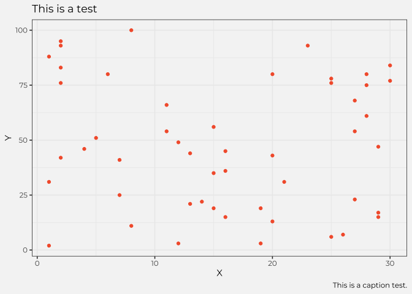

<!-- README.md is generated from README.Rmd. Please edit that file -->

# pedstyling

<!-- badges: start -->

<!-- badges: end -->

This package offers styling options with PEDSnet fonts and colors for
visualizing and reporting.

## Installation

You can install this package by running the following:

``` r
devtools::install_github("PEDSnet/pedstyling")
```

## Requirements

``` r
# Uncomment if the following packages are not yet installed
# install.packages(c("ggplot2","sysfonts","showtext"))

library(ggplot2)
library(sysfonts)
library(showtext)

# To load PEDSnet style fonts, only need to include the following lines once at the beginning of your code. 
font_add_google(name = "Lato", family = "lato")
font_add_google(name = "Montserrat", family = "montserrat")
showtext_auto()
```

## Usage

### Descriptive Functions

#### `pedsnet_cols`

Function to extract hex colors from PEDsnet styling palette by name

``` r
# Extracting hex and name of all colors in palette  
pedsnet_cols() 
#>    dark blue   light blue light purple  dark purple  brown green       orange 
#>    "#414770"    "#5b85ab"    "#d4c5c7"    "#372248"    "#b2aa8d"    "#f46037"

# Extracting hex and name for one color
pedsnet_cols("dark blue", "orange")
#> dark blue    orange 
#> "#414770" "#f46037"
```

``` r
# Example Usage
ggplot(...) + 
  geom_point(color = pedsnet_cols())

# To pull out specific colors: 
ggplot(...) + 
  geom_point(color = pedsnet_cols("orange"))
```

#### `pedsnet_pal`

Function to access and interpolate palette colors. All possible
palettes:

  - ‘main’
  - ‘dark’
  - ‘light’
  - ‘mixed’
  - ‘light-ish’

It is also possible to expand the color palette based on the original
hex codes. This is done by choosing a palette and the number of
additional codes to expand to:

``` r
# Example
pedsnet_pal("light")(6)
#> [1] "#F46037" "#B66E65" "#797D93" "#7391B0" "#A3ABBB" "#D4C5C7"
```


### Functions to use with ggplot2

#### `scale_color_pedsnet`

To specificy color palette when color argument is used

``` r
ggplot(dataset, aes(x, y, color = variable)) + 
    scale_color_pedsnet()
    
# To specify a palette 
ggplot(dataset, aes(x, y, color = variable)) + 
    scale_color_pedsnet(discrete = FALSE, palette = "light-ish")
```

``` r
# Example Plot with Stying
ggplot(df, aes(X, Y)) +
  geom_point(color=pedsnet_cols("orange")) + 
  theme_pedsnet() +
  labs(title = "This is a test",
       caption = "This is a caption test.")
```



#### `scale_fill_pedsnet`

To specificy color palette when fill argument is used:

``` r
ggplot(dataset, aes(x, y, fill = variable)) + 
    scale_fill_pedsnet()
    
# To specify a palette 
ggplot(dataset, aes(x, y, fill = variable)) + 
    scale_fill_pedsnet(palette = "light")
```

``` r
# Example Plot with Stying
ggplot(df, aes(X, Y, fill=Category_X)) +
  geom_bar(stat="identity") +
  scale_fill_pedsnet("mixed") +
  theme_pedsnet() +
  labs(title = "This is a test",
       caption = "This is a caption test.")
```


<small><i>This package was created using the following tutorial:
[Creating corporate colour palettes for
ggplot2](https://drsimonj.svbtle.com/creating-corporate-colour-palettes-for-ggplot2)
